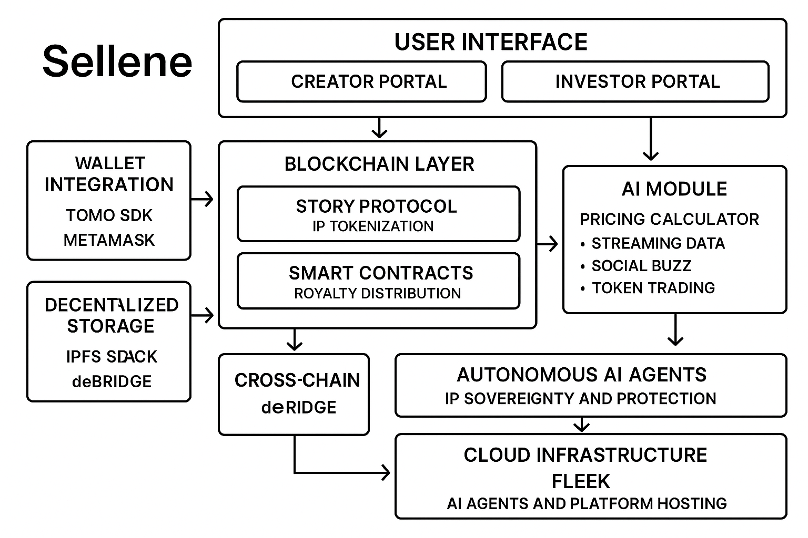
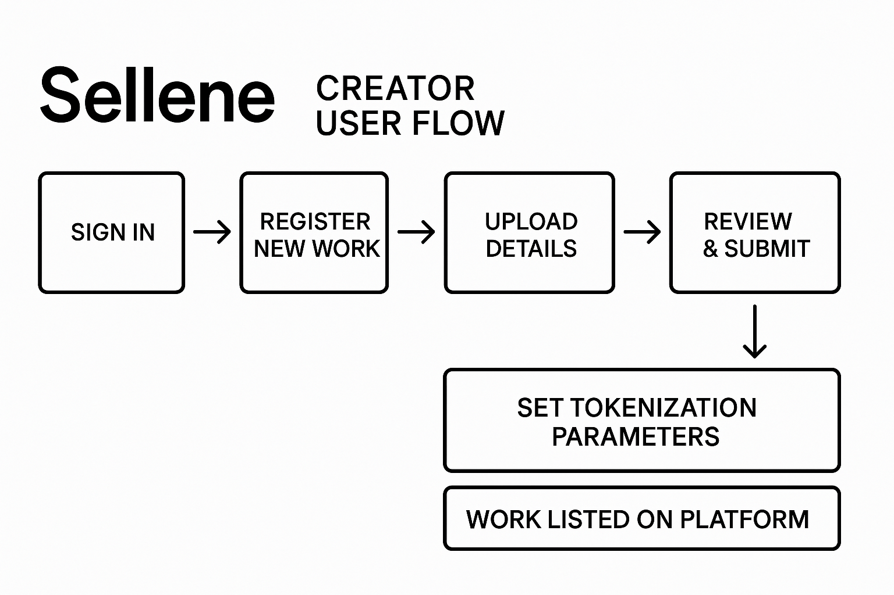
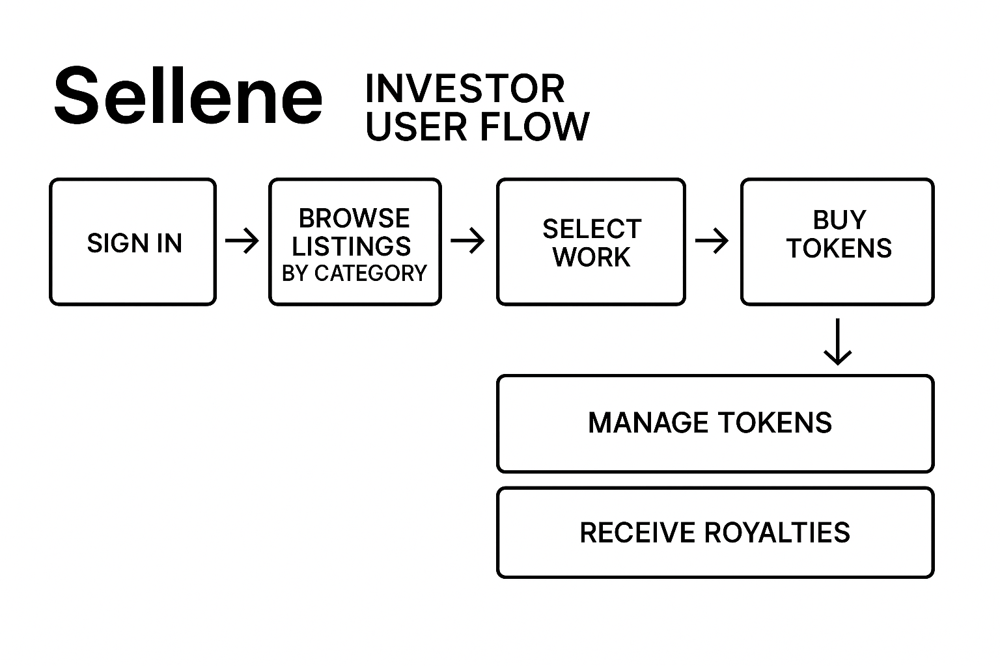

# Surreal Sellene - Decentralized IP Marketplace

<video src="https://github.com/user-attachments/assets/08172f8b-b89a-4516-98e4-3a025912d098" controls>
  Your browser does not support the video tag.
</video>

## The Idea

Imagine a website where artists, musicians, writers, or inventors can turn pieces of their work—like a song, a painting, or a patent—into tiny "shares" that anyone can buy. Here's how it works in plain terms:

### Turning Creative Work into Digital Shares
Think of a musician who has a new song. Instead of simply uploading it to YouTube, they "register" it on our platform. That registration creates, say, 1,000 digital tokens—each token representing 0.1% ownership of that song. So if you buy 10 tokens, you effectively own 1% of the song's future earnings.

### Buying and Selling Fractions of Work
Just like people trade stocks on a stock-exchange app, on this site you can browse different creative works that are listed for sale. Each listing shows how many tokens are available and the current price per token. If you see a piece you like (say, an up-and-coming painter's limited-edition print), you can buy as few as 1 or as many as 100 tokens, depending on how many are for sale.

### Sharing in Future Royalties
Whenever someone pays to use that work—maybe a film studio licenses that musician's song, or a company pays to use that painter's image—a small fee goes into a special account. Our system then automatically divides that fee among everyone who owns tokens, so you receive your share of the money right away.

### Simple, Clear Pricing Suggestions
One of the hardest parts of buying any creative work is knowing its real value. To help with that, we use a basic AI "calculator" behind the scenes. It looks at things like how many times the song has been streamed, how often people talk about the artist online, and how many tokens have changed hands before.

## Why It Matters

- **For creators:** Instead of waiting for a big check from a label, gallery, or publisher (who often take a large cut), they get access to money right away by selling small pieces of their work. They control how much of their work they sell and at what price.

- **For everyday investors:** You don't have to spend thousands on a single painting or wait for someone famous's song to take off. You can invest a small amount—maybe ₹500 or ₹1,000—and still earn money when that piece becomes more popular or gets licensed.

## Core Features

- **IP Tokenization**: Convert creative works into tradeable tokens
- **Fractional Ownership**: Buy and sell shares of IP assets
- **Automated Royalties**: Smart contract-based royalty distribution
- **Cross-Chain Support**: Seamless asset transfer across blockchains
- **AI-Powered Valuation**: Intelligent pricing suggestions for IP assets

## Technical Architecture



### Frontend
- React with TypeScript
- Chakra UI for modern, responsive design
- Wagmi for Web3 integration
- Story Protocol SDK for IP management

### Backend
- Node.js with Express
- Story Protocol integration
- deBridge for cross-chain functionality
- IPFS for decentralized storage

### Smart Contracts
- Story Protocol for IP registration
- Custom contracts for fractional ownership
- Royalty distribution mechanisms

## Track Implementations

We've integrated several key technologies to create a seamless and powerful IP marketplace:

### 1. Tomo Integration
- **Purpose**: Social login and wallet aggregation
- **Implementation**: 
  - Seamless wallet connection through Tomo SDK
  - Social media authentication (Google, Twitter, Discord)
  - Multi-wallet support (MetaMask, WalletConnect, Coinbase)
  - Simplified onboarding flow
- **Benefits**: 
  - Enhanced user experience
  - Reduced friction in wallet connection
  - Broader user accessibility

### 2. deBridge Integration
- **Purpose**: Cross-chain functionality
- **Implementation**:
  - Asset transfer between Ethereum and Aeneid
  - Liquidity aggregation across chains
  - Cross-chain IP trading
  - Automated bridge operations
- **Benefits**: 
  - Expanded market access
  - Improved liquidity
  - Seamless cross-chain operations

### 3. AWE Framework
- **Purpose**: Autonomous world creation
- **Implementation**:
  - Multi-agent interaction system
  - On-chain economy simulation
  - Persistent virtual environment
  - Real-time asset trading
- **Benefits**: 
  - Enhanced user engagement
  - Virtual asset trading
  - Immersive experience

### 4. Yakoa Integration
- **Purpose**: Content authenticity and originality
- **Implementation**:
  - AI-powered content verification
  - Originality detection algorithms
  - Automated licensing system
  - Plagiarism prevention
- **Benefits**: 
  - Trust in IP trading
  - Content authenticity
  - Automated rights management

### 5. Fleek Platform
- **Purpose**: AI agent infrastructure
- **Implementation**:
  - Virtual influencer creation
  - AI-driven content generation
  - Automated market making
  - Smart contract integration
- **Benefits**: 
  - Enhanced market efficiency
  - Automated trading
  - Improved user engagement

### 6. Gaia Stack
- **Purpose**: IP sovereignty and protection
- **Implementation**:
  - Autonomous verification system
  - IP protection mechanisms
  - Smart contract integration
  - Rights management
- **Benefits**: 
  - Enhanced security
  - Trust in transactions
  - Automated protection

### 7. Alchemy Web3
- **Purpose**: Blockchain infrastructure
- **Implementation**:
  - Enhanced RPC endpoints
  - Developer tools integration
  - Analytics dashboard
  - Performance monitoring
- **Benefits**: 
  - Improved performance
  - Better monitoring
  - Enhanced development experience

## User Flows

### Creator Flow


1. **IP Registration**
   - Upload creative work
   - Set tokenization parameters
   - Register on Story Protocol

2. **Token Creation**
   - Define total supply
   - Set initial price
   - Configure royalty structure

3. **Market Listing**
   - List tokens for sale
   - Set trading parameters
   - Monitor performance

### Investor Flow


1. **Asset Discovery**
   - Browse IP marketplace
   - Filter by category/type
   - View performance metrics

2. **Investment**
   - Purchase fractional shares
   - Monitor portfolio
   - Receive automated royalties

3. **Trading**
   - Buy/sell shares
   - Track performance
   - Manage investments

## Getting Started

### Prerequisites
- Node.js v18+
- MetaMask or compatible Web3 wallet
- Git

### Installation

1. Clone the repository:
```bash
git clone https://github.com/yourusername/surreal-sellene.git
cd surreal-sellene
```

2. Install dependencies:
```bash
# Install frontend dependencies
cd frontend
npm install

# Install backend dependencies
cd ../backend
npm install
```

3. Set up environment variables:
```bash
# Frontend
cp .env.example .env

# Backend
cp .env.example .env
```

4. Start the development servers:
```bash
# Start backend
cd backend
npm run dev

# Start frontend
cd frontend
npm run dev
```

## Technical Paper

Our technical paper provides detailed information about the project's architecture, implementation, and future roadmap. You can find it in the `technical-paper` folder:

[Technical Paper - Surreal Sellene](technical-paper/Technical-Paper-Sellene.pdf)

The paper covers:
- System architecture and design decisions
- Smart contract implementation details
- Security considerations and audits
- Economic model and tokenomics
- Future roadmap and development plans


